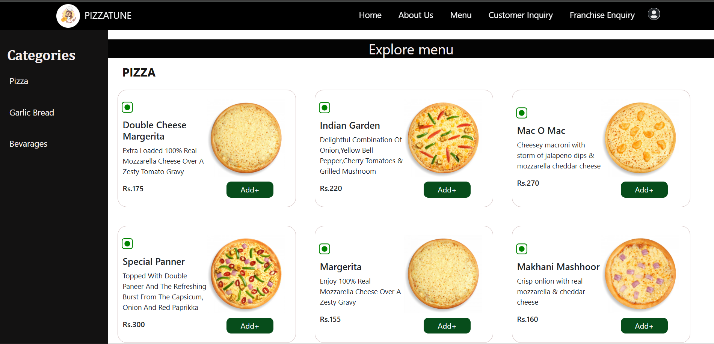

# 🍕 Pizzatune 

Pizzatune is a full-stack web application built using **React** for the frontend and **Django** for the backend with **MongoDB** as the database. The app lets users browse a menu, add items to a cart, place orders, and allows admin management of menu items.

---




## ⚙️ Tech Stack


### Frontend
- React
- Axios
- React Router
- Bootstrap

### Backend
- Django
- Django REST Framework
- pymongo (MongoDB client)
- Cloudinary (for image uploads)

### Database
- MongoDB

## 🚀 **[👉 CHECK IT LIVE 👈](https://pizza-tune-app-tnkz.vercel.app)**

🔗 Explore the full app here:  
**🍕 Pizzatune Live Demo →** [https://pizza-tune-app-tnkz.vercel.app](https://pizza-tune-app-tnkz.vercel.app)


## 🚀 Getting Started

### Clone the Repo

```bash
git clone https://github.com/Mansi4124/PizzaTuneApp.git
```
📦 Frontend Setup (/frontend)
```bash
cd frontend
npm install
npm start          # Run in dev mode
npm run build      # Create production build
```
Frontend Environment Variables (frontend/.env)

```bash
REACT_APP_BACKEND_URL='https://pizzatuneapp-10.onrender.com'
```

🔧 Backend Setup (/backend)
```bash
cd backend
pip install -r requirements.txt
```

# Backend Environment Variables (.env)

Create a `.env` file with the following:
- `SECRET_KEY=your-django-secret`
- `DEBUG=True`
- `MONGO_DB_NAME=your-db-name`
- `MONGO_DB_URI=your-mongodb-uri`


Run server:
```bash
python manage.py runserver
```

## 🛠️ Features

### 🔐 Common
- Login/Signup for Users and Admins
- Role-based dashboard rendering
- Email functionality to send invoices and inquiry responses

---

### 🧑‍🍳 Customer Side
- 🍕 Browse and filter food items
- 🛒 Add to Cart and Place Orders
- 🧾 Automatically generate and view the bill
- 📬 Submit inquiries (e.g., franchise, product questions)
- 📈 Visualized top-selling items to help discover trending meals

---

### 🛠️ Admin Side
- 📦 Add new items to the menu
- 📝 Update or delete existing menu items
- 📊 View detailed graphs:
  - Order history tracking
  - Top-selling items by day/month
- 📧 Respond to customer inquiries via email from the dashboard
- ✅ Manage and monitor customer activity and orders

🤝 Contributing
Contributions, issues, and feature requests are welcome!
Open a PR or issue to get started.
